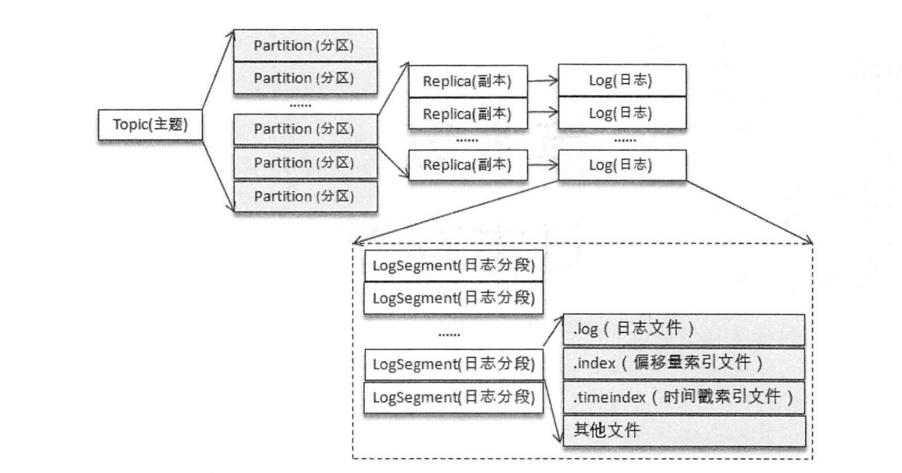
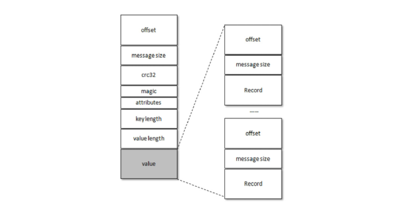
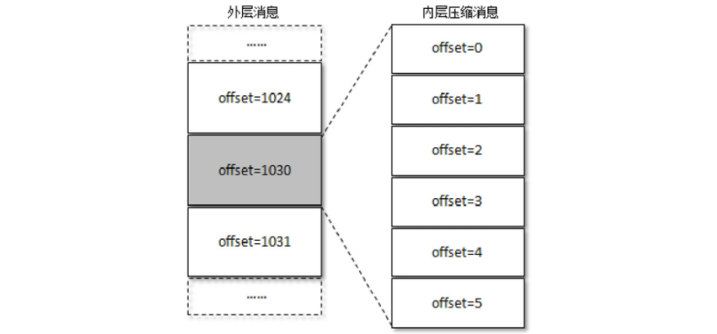

### 文件目录结构

`Kafka` 中的消息是以主题为基本单位进行归类的，各个主题在逻辑上相互独立。每个主题又可以分为一个或多个分区，分区的数量可以在主题创建的时候指定，也可以在之后修改。每条消息在发送的时候会根据分区规则被追加到指定的分区中，分区中的每条消息都会被分配一个唯一的序列号，也就是通常所说的偏移量。如果分区规则设置得合理，那么所有的消息可以均匀地分布到不同的分区中，这样就可以实现水平扩展。不考虑多副本的情况，一个分区对应一个日志。为了防止 `Log` 过大，`Kafka` 又引入了日志分段（`LogSegment`）的概念，将 `Log` 切分为多个 `LogSegment` ，相当于一个巨型文件被平均分配为多个相对较小的文件，这样也便于消息的维护和清理。事实上，`Log` 和 `LogSegment` 也不是纯粹物理意义上的概念，`Log` 在物理上只以文件夹的形式存储，而每个 `LogSegment` 对应于磁盘上的一个日志文件和两个索引文件，以及可能的其他文件（比如以 `.txnindex` 为后缀的事务索引文件）。

`Log` 对应了一个命名形式为 `＜topic＞-＜partition＞` 的文件夹。举个例子，假设有一个名为 `topic-log` 的主题，此主题中具有 `4` 个分区，那么在实际物理存储上表现为 `topic-log-0` `topic-log-1` `topic-log-2` `topic-log-3` 这 `4` 个文件夹。

向 `Log` 中追加消息时是顺序写入的，只有最后一个 `LogSegment` 才能执行写入操作，在此之前所有的 `LogSegment` 都不能写入数据。为了方便描述，我们将最后一个 `LogSegment` 称为 `activeSegment` ，即表示当前活跃的日志分段。随着消息的不断写入，当 `activeSegment` 满足一定的条件时，就需要创建新的`activeSegment` ，之后追加的消息将写入新的 `activeSegment` 。

为了便于消息的检索，每个 `LogSegment` 中的日志文件（以 `.log` 为文件后缀）都有对应的两个索引文件：偏移量索引文件（以 `.index` 为文件后缀）和时间戳索引文件（以 `.timeindex` 为文件后缀）。每个 `LogSegment` 都有一个基准偏移量 `baseOffset`，用来表示当前 `LogSegment` 中第一条消息的 `offset` 。偏移量是一个 `64` 位的长整型数，日志文件和两个索引文件都是根据 `baseOffset ` 命名的，名称固定为 `20` 位数字，没有达到的位数则用 `0` 填充。比如第一个 `LogSegment` 的基准偏移量为 `0` ，对应的日志文件为 `00000000000000000000.log` 。

注意每个 `LogSegment` 中不只包含 `.log` `.index` `.timeindex` 这 `3` 种文件，还可能包含 `.deleted` `.cleaned` `.swap` 等临时文件，以及可能的 `.snapshot` `.txnindex` `leader-epoch-checkpoint` 等文件。从更加宏观的视角上看，`Kafka` 中的文件不只上面提及的这些文件，比如还有一些检查点文件，当一个 `Kafka` 服务第一次启动的时候，默认的根目录下就会创建以下 `5` 个文件：

消费者提交的位移是保存在 `Kafka` 内部的主题 `__consumer_offsets` 中的，初始情况下这个主题并不存在，当第一次有消费者消费消息时会自动创建这个主题。

在某一时刻，`Kafka` 中的文件目录布局如下图所示。每一个根目录都会包含最基本的 `4` 个检查点文件（ `xxx-checkpoint` ）和 `meta.properties` 文件。在创建主题的时候，如果当前 `broker` 中不止配置了一个根目录，那么会挑选分区数最少的那个根目录来完成本次创建任务。

### 文件格式演变

对于一个成熟的消息中间件而言，日志格式不仅关系功能维度的扩展，还牵涉性能维度的优化。随着 `Kafka` 的迅猛发展，其消息格式也在不断升级改进，每个分区由内部的每一条消息组成，如果消息格式设计得不够精炼，那么其功能和性能都会大打折扣。比如有冗余字段，势必会不必要地增加分区的占用空间，进而不仅使存储的开销变大、网络传输的开销变大，也会使Kafka的性能下降。反观如果缺少字段，比如在最初的 `Kafka` 消息版本中没有 `timestamp` 字段，对内部而言，其影响了日志保存、切分策略，对外部而言，其影响了消息审计、端到端延迟、大数据应用等功能的扩展。虽然可以在消息体内部添加一个时间戳，但解析变长的消息体会带来额外的开销，而存储在消息体前面可以通过指针偏移量获取其值而容易解析，进而减少了开销，虽然相比于没有 `timestamp` 字段的开销会大一点。

#### `v0` 版本

`kafka` 消息格式的第一个版本通常称为 `v0` 版本，在 `Kafka` `0.8.x` 之后 `0.10.0` 之前都采用的这个消息格式。

下图左边的 `RECORD` 部分就是 `v0` 版本的消息格式，大多数人会把左边的整体都看作消息，因为每个 `RECORD（v0和v1版）` 必定对应一个 `offset` 和 `message size` 。每条消息都有一个 `offset` 用来标志它在分区中的偏移量，这个 `offset` 是逻辑值，而非实际物理偏移值，`message size` 表示消息的大小，这两者在一起被称为日志头部（`LOG_OVERHEAD`），固定为 `12B` 。`LOG_OVERHEAD` 和 `RECORD` 一起用来描述一条消息，在讲述具体消息格式时会偏向于将单纯的 `RECORD` 看作消息，而在其他地方则偏向于将 `LOG_OVERHEAD` 和 `RECORD` 的整体看作消息。与消息对应的还有消息集的概念，消息集中包含一条或多条消息，消息集不仅是存储于磁盘及在网络上传输（ `Produce ＆ Fetch`）的基本形式，而且是 `Kafka` 中压缩的基本单元。

消息格式中的各个字段，从 `crc32` 开始算起，各个字段的解释如下：

1.  `crc32（4B）` ：`crc32` 校验值。校验范围为 `magic` 至 `value` 之间。
2.  `magic（1B）` ：消息格式版本号，此版本的 `magic` 值为 `0` 。
3.  `attributes（1B）` ：消息的属性。总共占 `1` 个字节，低 `3` 位表示压缩类型： `0` 表示 `NONE` 、 `1` 表示 `GZIP` 、 `2` 表示` SNAPPY` 、 `3` 表示 `LZ4` （ `LZ4` 自 `Kafka 0.9.x` 引入），其余位保留。
4.  `key length（4B）` ：表示消息的 `key` 的长度。如果为 `-1` ，则表示没有设置 `key` ，即 `key = null` 。
5.  `key` ：可选，如果没有 `key` 则无此字段。
6.  `value length（4B）` ：实际消息体的长度。如果为 `-1` ，则表示消息为空。
7.  `value` ：消息体。可以为空，比如墓碑（ `tombstone` ）消息。

 `v0` 版本中一个消息的最小长度（ `RECORD_OVERHEAD_V0` ）为 `crc32 + magic + attributes + key length  + value length = 4B + 1B + 1B + 4B + 4B = 14B` 。也就是说，`v0` 版本中一条消息的最小长度为 `14B` ，如果小于这个值，那么这就是一条破损的消息而不被接收。

#### `v1` 版本

 `Kafka` 从 `0.10.0` 版本开始到 `0.11.0` 版本之前所使用的消息格式版本为 `v1` ，比 `v0` 版本就多了一个 `timestamp` 字段，表示消息的时间戳。 `v1` 版本的 `magic` 字段的值为 `1` 。 `v1` 版本的 `attributes` 字段中的低 `3` 位和 `v0` 版本的一样，还是表示压缩类型，而第 `4` 个位（ `bit` ）也被利用了起来： `0` 表示 `timestamp` 类型为 `CreateTime` ，而 `1` 表示 `timestamp` 类型为 `LogAppendTime` ，其他位保留。 `timestamp` 类型由` broker` 端参数 `log.message.timestamp.type` 来配置，默认值为 `CreateTime` ，即采用生产者创建消息时的时间戳。如果在创建 `ProducerRecord` 时没有显式指定消息的时间戳，那么 `KafkaProducer` 也会在发送这条消息前自动添加上。

常见的压缩算法是数据量越大压缩效果越好，一条消息通常不会太大，这就导致压缩效果并不是太好。而 `Kafka` 实现的压缩方式是将多条消息一起进行压缩，这样可以保证较好的压缩效果。在一般情况下，生产者发送的压缩数据在 `broker` 中也是保持压缩状态进行存储的，消费者从服务端获取的也是压缩的消息，消费者在处理消息之前才会解压消息，这样保持了端到端的压缩。 `Kafka` 日志中使用哪种压缩方式是通过参数 `compression.type` 来配置的，默认值为 `producer` ，表示保留生产者使用的压缩方式。这个参数还可以配置为 `gzip` `snappy` `lz4`，分别对应 `GZIP`、`SNAPPY`、`LZ4` 这 `3` 种压缩算法。如果参数 `compression.type` 配置为 `uncompressed`，则表示不压缩。

当消息压缩时是将整个消息集进行压缩作为内层消息（ `inner message` ），内层消息整体作为外层（ `wrapper message` ）的 `value` ，其结构如下图所示。

压缩后的外层消息（ `wrapper message` ）中的 `key` 为 `null` ，所以上图左半部分没有画出 `key` 字段， `value` 字段中保存的是多条压缩消息（ `inner message` ，内层消息），其中 `Record` 表示的是从 `crc32` 到 `value` 的消息格式。当生产者创建压缩消息的时候，对内部压缩消息设置的 `offset` 从 `0` 开始为每个内部消息分配 `offset` ，详细可以参考下图右半部分。

其实每个从生产者发出的消息集中的消息 `offset` 都是从 `0` 开始的，当然这个 `offset` 不能直接存储在日志文件中，对 `offset` 的转换是在服务端进行的，客户端不需要做这个工作。外层消息保存了内层消息中最后一条消息的绝对位移（`absoluteoffset`），绝对位移是相对于整个分区而言的。对于未压缩的情形，上图右内层消息中最后一条的 `offset` 理应是 `1030` ，但被压缩之后就变成了 `5` ，而这个 `1030` 被赋予给了外层的 `offset` 。当消费者消费这个消息集的时候，首先解压缩整个消息集，然后找到内层消息中最后一条消息的 `inner offset` ，计算出内层消息中最后一条消息前面的消息的 `absolute offset` 。

**注意要点：** 压缩消息，英文是 `compress message` ， `Kafka` 中还有一个 `compactmessage` ，常常被人们直译成压缩消息，需要注意两者的区别。 `compactmessage` 是针对日志清理策略而言的，是指日志压缩后的消息。

#### 变长字段

`Kafka` 从 `0.11.0` 版本开始所使用的消息格式版本为 `v2` ，这个版本的消息相比 `v0` 和 `v1` 的版本而言改动很大，同时还参考了 `Protocol Buffer` 而引入了变长整型（ `Varints` ）和 `ZigZag` 编码。 `Varints` 是使用一个或多个字节来序列化整数的一种方法。数值越小，其占用的字节数就越少。 `Varints` 中的每个字节都有一个位于最高位的 `msb` 位（ `most significantbit` ），除最后一个字节外，其余 `msb` 位都设置为 `1` ，最后一个字节的 `msb` 位为 `0` 。这个 `msb` 位表示其后的字节是否和当前字节一起来表示同一个整数。除 `msb` 位外，剩余的 `7` 位用于存储数据本身，这种表示类型又称为 `Base 128` 。通常而言，一个字节 `8` 位可以表示 `256` 个值，所以称为 `Base 256` ，而这里只能用 `7` 位表示， `2` 的 `7` 次方即 `128` 。

`Varints` 可以用来表示 `int32` 、`int64` 、`uint32` 、`uint64` 、`sint32` 、`sint64` 、`bool` 、`enum` 等类型。在实际使用过程中，如果当前字段可以表示为负数，那么对 `int32/int64` 和 `sint32/sint64` 而言，它们在进行编码时存在较大的区别。比如使用 `int64` 表示一个负数，那么哪怕是 `-1` ，其编码后的长度始终为 `10` 个字节，就如同对待一个很大的无符号长整型数一样。为了使编码更加高效，`Varints` 使用了 `ZigZag` 的编码方式。

#### `v2` 版本

`v2` 版本中消息集称为 `Record Batch` ，而不是先前的 `Message Set` ，其内部也包含了一条或多条消息。在消息压缩的情形下，`Record Batch Header` 部分（从 `first offset` 到 `records count` 字段）是不被压缩的，而被压缩的是 `records` 字段中的所有内容。生产者客户端中的 `ProducerBatch` 对应这里的 `RecordBatch` ，而 `ProducerRecord` 对应这里的 `Record` 。

内部字段大量采用了 `Varints` ，这样 `Kafka` 可以根据具体的值来确定需要几个字节来保存。 `v2` 版本的消息格式去掉了 `crc` 字段，另外增加了 `length` 、 `timestamp delta` 、 `offset delta` 和 `headers` 信息，并且 `attributes` 字段被弃用了。

