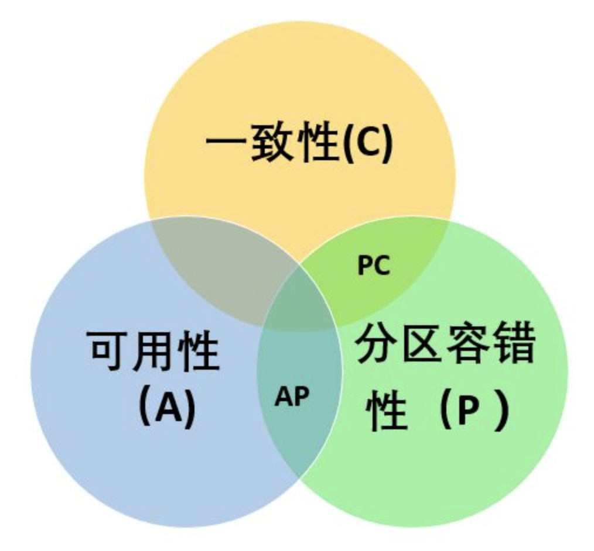

从集中式到分布式

大型机虽然在性能和稳定性方面有卓越表现，但是其具有集中式系统的单点问题，并且扩展性非常差。随着小型机性能的不断提升和网络技术的快速发展，越来越多的人改用了小型机来搭建分布式系统。

#### 分布式系统

分布式系统是一个硬件或软件组件分布在不同的网络计算机上，彼此之间通过消息传递进行通信和协调的系统。

没有任何业务逻辑约束的分布式系统的特点：

- 分布性：分布式系统中的多台机器会在空间上随意分布。
- 对等性：各机器没有主从之分。
- 并发性：多个节点可能会进行并发操作。
- 缺乏全局时钟：分布式系统中缺乏一个全局的时钟序列控制。
- 故障总是会发生：一个被大量工程实践所检验过的黄金定理：任何在设计阶段考虑到的异常情况，一定会在系统实际运行中发送，并且实际运行中还会遇到很多未考虑到的异常故障。

#### 分布式系统的问题

- 通信异常

- 网络分区，即脑裂。（由于网络异常导致只有部分节点能够进行正常通信，会出现局部小集群等问题）

- 三态：分布式系统的每一次请求与响应会存在三种结果：成功、失败、超时。

- 节点故障：分布式节点可能会出现宕机等故障。

#### 事务的ACID特性

事务是由一系列对系统中数据进行访问与更新操作所组成的一个程序执行逻辑单元。其具有四个特性：

- 原子性：一个事务中的操作要么全部执行要么全部不执行。
- 一致性：事务执行的结果必须是使数据库从一个一致性状态转变到另一个一致性状态。
- 隔离性：并发的事务是相互隔离的，相互之间不能干扰。
- 持久性：事务一旦被提交，对数据库状态的变更就是永久的。

#### 分布式事务

在单机系统中，很容易实现一套满足ACID特性的事务处理系统。但是在分布式系统中，数据分散在不同的机器上分布式事务中的各个子事务的执行是分布式的，因此分布式的事务处理会碰到很多问题。

#### CAP定理

一个分布式系统不可能同时满足**一致性**、**可用性**、**分区容错性**这三个基本需求，最多只能同时满足其中两种。

- 一致性

  一个多副本的系统在数据一致性的状态下执行了更新操作后，应该保证系统的数据仍然处于一致性状态。

- 可用性

  系统提供的服务必须一直处于可用状态，即对于用户的每一个操作请求总是在有限时间内返回结果。

- 分区容错性

  分布式系统在遇到任何网络分区故障的时候，仍然需要能够保证对外提供满足一致性和可用性的服务，除非是整个网络都发生了故障。

对于一个分布式系统而言，分区容错性是最基本的要求。因此架构师们往往把精力花在如何根据业务特点在一致性和可用性之间寻求平衡。

#### BASE理论

即使无法做到强一致性，但是每个应用都可以根据自身的业务特点，采用适当的方式来使系统达到最终一致性。

BASE理论三要素：

- 基本可用：分布式系统在出现不可预知故障的时候，允许损失部分可用性。
  - 响应时间上的损失：可以慢一点。
  - 功能上损失：请求高峰期间可以进行服务降级。
- 弱状态：允许系统在不同的数据副本之间进行数据同步的过程存在延时。
- 最终一致性：系统中所有的数据副本，在经过一段时间的同步后，最终能达到一个一致性状态。

最终一致性的五类主要变种：

- 因果一致性：进程A在更新完某个数据项后通知了进程B，那么之后进程B之后访问该数据项得到的都是A更新后的最新值。
- 读己之所写：进程A更新了一个数据项后，它自己总是能够访问到更新过的最新值。
- 会话一致性：执行完更新操作后，客户始终能够在一个会话中读取到该数据的最新值。
- 单调读一致性：进程A读取到一个数据项的某个值后，都不会再读取到旧值。
- 单调写一致性：系统能够保证来自一个进程的写操作被顺序执行。

